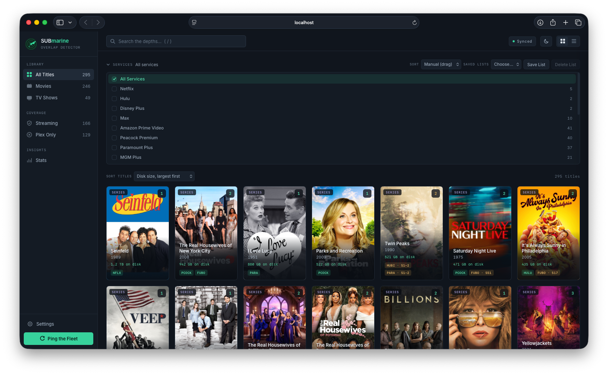
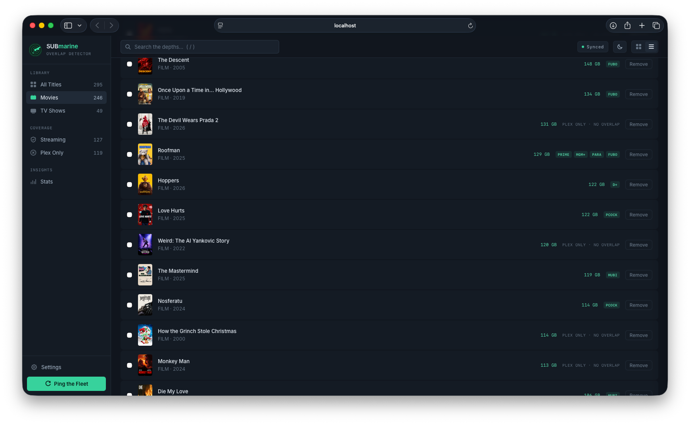
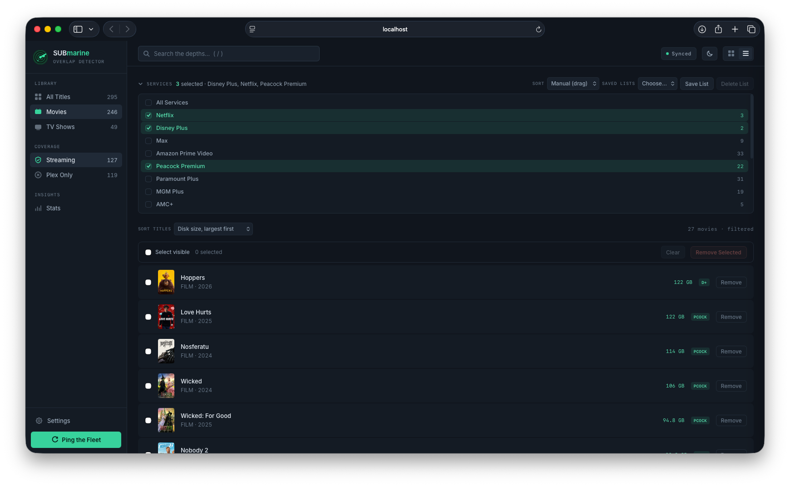
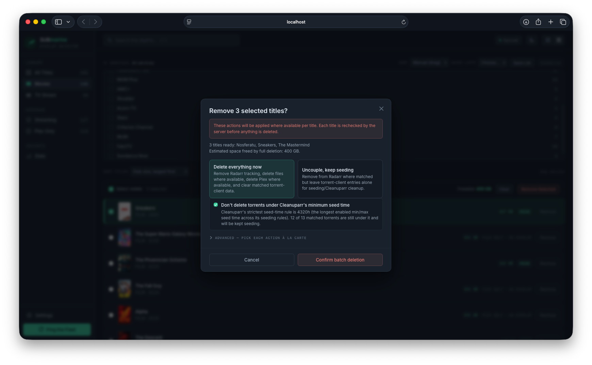
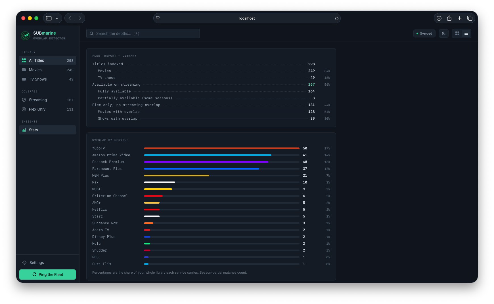

# SUBmarine

**A scanner for Plex overlap with streaming services.**

SUBmarine compares your Plex movie and TV libraries against the streaming services you (might) already pay for, using TMDB watch-provider data. It answers the question: *"How much of my library is already available on Netflix, Max, Hulu, …?"* — so you can reclaim disk space with confidence.

## Screenshots

<p align="center"></p>

<table>
<tr>
<td width="50%"><br><sub>List view — size at a glance, remove without leaving the row</sub></td>
<td width="50%"><br><sub>Filter down to the services you pay for</sub></td>
</tr>
<tr>
<td width="50%"><br><sub>Guided removal — pick a protocol, seed-time protection built in</sub></td>
<td width="50%"><br><sub>A stats printout.</sub></td>
</tr>
</table>

## How it works

1. **Sync** — SUBmarine reads your Plex libraries and asks TMDB which streaming services carry each title (matching whole shows season-by-season, not just by name).
2. **Browse** — see what's redundant in a poster grid or list, filter by service, sort by disk size, and check the Stats page for the library-wide picture.
3. **Reclaim** — pick a title (or a batch), preview exactly what removal would touch, and confirm once. SUBmarine can clean up Plex, Radarr/Sonarr, active downloads, and torrent-client entries in one guided step — without cutting a torrent short of your seed-time rules.

## Features

**Browsing & insights**
- **Poster grid & list views** — searchable, filterable by service (vertical service-list menu with saved lists), and sortable by title, year, streaming overlap, or on-disk size, with each title's measured disk footprint shown inline. Rendering is flicker-free — posters are never reloaded on filter or sort changes, and reorders animate into place.
- **Season-aware TV matching** — a show only counts as "on Netflix" if every season you actually have in Plex is streamable; partial coverage is shown per season.
- **Stats report page** — a printout-style report of library composition, per-service overlap shares, and disk space: total measured usage, how much of it is held by titles you could stream instead, and your largest titles. Disk usage is measured on demand.
- **Freeable-space measurement** — each title's detail view lists the actual files on disk across Plex, Radarr/Sonarr, and the torrent client, deduplicating hardlinked copies (matched by identical byte size) so a 1080p and a 4K copy count separately but a torrent and its Radarr import count once. Selecting titles in list view keeps a live running total of the space a cleanup would free, in a selection toolbar that stays pinned while you scroll.
- **Light/dark theme** — follows the OS appearance (including macOS auto-switching) by default, with a manual light/dark override.

**Cleanup automation**
- **Guided removal (movies & TV)** — one dialog can remove a title from Plex (with files), Radarr or Sonarr, active downloads, matched torrent-client entries (qBittorrent / Transmission), and trigger Cleanuparr. Preset "protocols" cover the common cases; every step is individually switchable under Advanced, opt-in, and previewed first.
- **Seed-time protection** — optionally reads Cleanuparr's Download Cleaner seeding rules and keeps any matched torrent that has not yet met the strictest enabled seed-time bound (min *or* max seed time — Cleanuparr can clean on either), so removals never cut a torrent short of your tracker rules.

**Setup & operations**
- **First-run setup wizard** — connection testing and auto-discovery for Radarr, Sonarr, Cleanuparr, and torrent clients on common hosts/ports.
- **Fast incremental sync** — titles are fingerprinted, so re-syncs only hit TMDB for new or changed items; parallel workers keep full syncs quick.
- **Single container** — Flask + SQLite, no external database, multi-arch image (amd64/arm64).

## Quick start

```bash
curl -O https://raw.githubusercontent.com/anon1y4012/SUBmarine/main/docker-compose.example.yml
cp docker-compose.example.yml docker-compose.yml
docker compose up -d
```

Open `http://localhost:5055` and follow the setup wizard. You will need:

- Your Plex server IP/port and a [Plex token](https://support.plex.tv/articles/204059436-finding-an-authentication-token-x-plex-token/)
- A free [TMDB API key](https://www.themoviedb.org/settings/api)
- (Optional) Radarr / Sonarr / Cleanuparr / torrent client details for removal features

Prebuilt images are published to GHCR on every commit to `main`, for both `linux/amd64` and `linux/arm64` (Raspberry Pi, most NAS boxes, Apple Silicon):

```yaml
image: ghcr.io/anon1y4012/submarine:latest
```

## Configuration

All settings are managed in the UI after first-run setup and stored in the SQLite database. Environment variables provide defaults and deployment-level controls:

| Variable | Default | Purpose |
|---|---|---|
| `DB_PATH` | `/data/submarine.db` | SQLite database location (put it on the `/data` volume) |
| `SYNC_WORKERS` | `8` | Parallel TMDB request workers during sync (1–32) |
| `WEB_WORKERS` | `2` | Gunicorn worker processes |
| `LOG_LEVEL` | `INFO` | `DEBUG`, `INFO`, `WARNING`, or `ERROR` |
| `SUBMARINE_AUTH_TOKEN` | *(unset)* | Enforce a fixed access token (see Security) |
| `PLEX_IP`, `PLEX_PORT`, `PLEX_TOKEN`, `MOVIE_LIBRARY_ID`, `TV_LIBRARY_ID`, `TMDB_API_KEY` | *(unset)* | Seed initial settings for unattended installs |

## API overview

Read-only endpoints are open on the trusted network; state-changing and credential-bearing endpoints require the access token (`Authorization: Bearer <token>` or `X-Submarine-Token`).

| Endpoint | Method | Auth | Purpose |
|---|---|---|---|
| `/api/health` | GET | — | Liveness probe (used by the Docker healthcheck) |
| `/api/titles` | GET | — | Library titles with provider matches (`type`, `services` filters) |
| `/api/service_counts` | GET | — | Per-service overlap counts (`type` filter) |
| `/api/status` | GET | — | Sync state and library counts |
| `/api/sync` | POST | ✔ | Start a background sync |
| `/api/settings` | GET/POST | ✔ | Read (secrets masked) / update settings |
| `/api/settings/test` | POST | ✔ | Test a connection (Plex, TMDB, *arr, torrent client) |
| `/api/settings/discover` | POST | ✔ | Probe common hosts/ports for integrations |
| `/api/space/<id>` | GET | ✔ | Unique on-disk files and freeable bytes for a title |
| `/api/remove/<id>/preview` | GET | ✔ | Preview what a removal would touch |
| `/api/remove/<id>` | POST | ✔ | Execute confirmed removal actions |

## Security

SUBmarine is intended for a trusted network. After first-run setup, settings,
connection-test, discovery, debug, sync, and removal endpoints can require a
SUBmarine access token. New installs generate this token during setup and keep it
in the browser's local storage; the server stores only a SHA-256 digest.

For existing installs, set `SUBMARINE_AUTH_TOKEN` before upgrading to enable
authentication immediately:

```yaml
environment:
  SUBMARINE_AUTH_TOKEN: "choose-a-long-random-token"
```

If no token is configured on an existing database, SUBmarine keeps the local-first
behavior to avoid locking you out. Add `SUBMARINE_AUTH_TOKEN` and restart when
you are ready to enforce authentication.

Do not expose the container directly to the internet. Bind the published port to
`127.0.0.1` for local-only use, or put it behind an authenticated reverse proxy
when remote access is needed. Library titles, poster art, and per-service overlap
counts are readable without a token by design (so the dashboard works before
first-run setup); everything that reads or changes credentials, triggers a sync,
measures disk usage, or removes a title requires the token once one exists. On a
shared or otherwise untrusted LAN, put SUBmarine behind a reverse proxy rather
than relying on the token alone to keep library contents private.

The `/data` volume stores service credentials in the SQLite database. Restrict access
to that volume, browser profiles that hold the access token, and application logs.

The container runs as an unprivileged user and sends no data anywhere except the
services you configure (Plex, TMDB, and optional integrations).

## Development

```bash
python3 -m venv .venv && source .venv/bin/activate
pip install -r requirements-dev.txt

# Run the app (uses ./data/submarine.db unless DB_PATH is set)
DB_PATH=./data/submarine.db python app.py

# Quality gates (same as CI)
ruff check .
pytest
```

The stack is deliberately small: one Flask module ([app.py](app.py)), one HTML template
([templates/index.html](templates/index.html)) with no build step, and SQLite. CI lints,
tests, and then publishes the Docker image; pull requests run the same lint/test gate.
